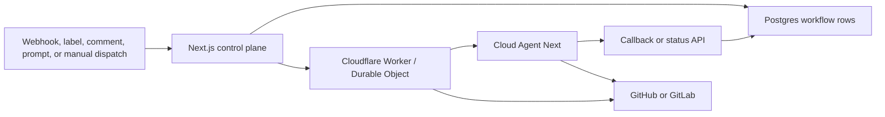

# Automation Services Architecture

Automation services turn source-control events, labels, comments, review requests, and user prompts into controlled Cloud Agent work.


This page covers cloud automation service boundaries in `Kilo-Org/cloud`. It complements [Cloud Platform](/docs/contributing/architecture/cloud-platform), which remains the service inventory.


## Source Map

| Service | Source |
|---|---|
| Kilo Bot | `apps/web/src/lib/bot/`, `apps/web/src/lib/bots/` |
| Code Review | `apps/web/src/lib/code-reviews/`, `services/code-review-infra/` |
| Auto Triage | `apps/web/src/lib/auto-triage/`, `services/auto-triage-infra/` |
| Auto Fix | `apps/web/src/lib/auto-fix/`, `services/auto-fix-infra/` |
| App Builder | `apps/web/src/lib/app-builder/` |
| Cloud Agent Next | `services/cloud-agent-next/` |

## Shared Pattern

Most automation services use the web app for business rules, authorization, configuration, and persistence. Workers and Durable Objects hold long-running orchestration, Cloud Agent connections, callbacks, and timeout recovery.

## Service Inventory

| Service | Trigger | Worker boundary | Cloud Agent use |
|---|---|---|---|
| Kilo Bot | GitHub/GitLab issue comments, PR mentions, and bot commands | Web app dispatch and bot libraries | Launches coding sessions for requested repository work |
| Code Review | Pull-request webhooks and review dispatch | `code-review-infra` Durable Object per review | Runs review sessions and posts feedback |
| Auto Triage | GitHub issue events and dispatch queue | `auto-triage-infra` Durable Object per ticket | Runs classification sessions after duplicate check when needed |
| Auto Fix | `kilo-auto-fix` label or dispatch rule | `auto-fix-infra` Durable Object per fix ticket | Creates PRs through Cloud Agent |
| App Builder | User prompt in web product | Web app app-builder orchestration | Scaffolds, iterates, and deploys generated apps |
| Security Agent | Dependabot sync and analysis queue | `security-auto-analysis` owner queue worker | Conditional; launches deep analysis only when triage asks for sandbox work |

## Code Review

Code Review queues pull-request work in the database, enforces per-owner concurrency in the Next.js dispatch layer, and starts a `CodeReviewOrchestrator` Durable Object when a slot is available.

| Concern | Behavior |
|---|---|
| Queue | Reviews wait in DB as pending rows |
| Concurrency | Per-owner active count controls dispatch slots |
| Worker | Durable Object keeps the Cloud Agent connection alive |
| Completion | Worker updates DB and triggers dispatch of next pending review |
| Output | Review feedback is posted back to the pull request |

## Auto Triage

Auto Triage classifies GitHub issues and applies labels or status updates. It first checks duplicates through the web backend. Non-duplicate issues can launch `cloud-agent-next` for classification using prepare, initiate, and callback flow.

| Concern | Behavior |
|---|---|
| Duplicate check | Calls Next.js API and can complete without Cloud Agent |
| Classification | Cloud Agent session runs structured classification prompt |
| Callback | `POST /tickets/:ticketId/classification-callback` with per-ticket secret |
| High confidence | Applies labels such as `kilo-auto-fix` for downstream Auto Fix |
| Timeout | Durable Object alarm marks stuck tickets failed |

## Auto Fix

Auto Fix receives dispatch requests when issues are labeled for automated fixes. A Durable Object manages fix session state, launches Cloud Agent, and reports status to the backend.

| Concern | Behavior |
|---|---|
| Trigger | Label or dispatch rule selects issue for fixing |
| Worker | `AutoFixOrchestrator` owns fix session state |
| Execution | Cloud Agent creates branch and PR for issue fix |
| Status | Worker reports lifecycle updates to internal backend API |

## Kilo Bot and App Builder

Kilo Bot is the source-control command surface. It interprets issue comments, PR mentions, and platform events, then dispatches Cloud Agent work with repository context.

App Builder is prompt-driven product orchestration. It uses Cloud Agent to scaffold, iterate, and deploy applications from user prompts rather than source-control webhook events.

## Ownership and Integrations

| Dimension | Model |
|---|---|
| Owner scope | Personal and organization owners are handled separately |
| Source control | GitHub is primary for review, triage, fix, and security flows; GitLab is supported in selected bot and Cloud Agent paths |
| Credentials | Web app resolves user, bot, or installation tokens and passes scoped access to workers or Cloud Agent |
| Callback auth | Workers use internal secrets, service bindings, or per-run callback secrets depending on service |
| Cloud Agent sandbox | All Cloud Agent launches inherit policy-driven sandbox identity and session-specific workspace paths |

## Current Implementation Notes

- Code Review worker logic is intentionally thin; concurrency and dispatch decisions live in Next.js.
- Auto Triage PR creation is not inside the triage worker. High-confidence classification applies labels that Auto Fix consumes.
- Auto Fix creates PRs through Cloud Agent and reports status through internal backend APIs.
- Security Agent is documented separately because finding sync, SLA state, and auto-analysis queue semantics are product-specific.
