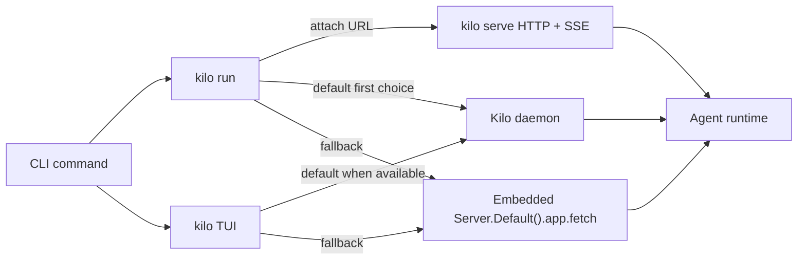
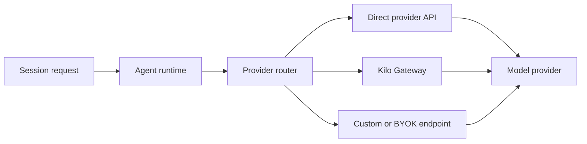

# CLI Runtime Architecture

The CLI (`packages/opencode/`) is Kilo's core agent engine. It contains the AI agent runtime, tool execution, session management, provider integrations, configuration, language intelligence, and HTTP server.


This page describes local CLI runtime modes and client communication. It is not a complete guide to every command flag or server endpoint.


## Source Map

| Concern | Source |
|---|---|
| `kilo run` modes | `packages/opencode/src/cli/cmd/run.ts` |
| `kilo run` daemon attach | `packages/opencode/src/kilocode/cli/cmd/run.ts` |
| Daemon discovery | `packages/opencode/src/kilocode/daemon/client.ts` |
| TUI daemon and fallback paths | `packages/opencode/src/cli/cmd/tui/thread.ts` |
| HTTP server | `packages/opencode/src/server/server.ts` |

## Runtime Modes

| Mode | Command | Runtime model |
|---|---|---|
| Interactive TUI | `kilo` | Renders a SolidJS interface through OpenTUI and can attach to daemon-backed services or use local fallback paths |
| Headless run | `kilo run` | Executes one prompt through daemon attach when available, then embedded server fetch fallback |
| API server | `kilo serve` | Starts an HTTP + SSE server for clients such as the VS Code extension |
| Attached run | `kilo run --attach <url>` | Connects to an explicit running `kilo serve` backend instead of starting local services |

## Core Subsystems

| Subsystem | Purpose |
|---|---|
| Agent Runtime | Orchestrates conversations, tool calls, permissions, and multi-step task execution |
| Tools Service | Provides built-in tools for file editing, shell execution, search, diagnostics, and more |
| MCP Servers | Extends the agent with Model Context Protocol servers |
| LSP Client | Integrates language server diagnostics and code intelligence |
| Session Manager | Persists session state, conversation history, metadata, and checkpoints |
| Provider Router | Connects to model providers directly or through Kilo Gateway |
| HTTP Server | Publishes REST and SSE surfaces for client integrations |
| Config System | Resolves project and global configuration, modes, tools, permissions, and provider settings |

## Communication Model

Not every surface talks to the CLI over a long-lived external server. HTTP + SSE is used when a separate client needs to drive a running CLI backend. Local commands can also call SDK-shaped clients backed by the daemon or embedded server fetch path.

| Caller | How it reaches runtime |
|---|---|
| TUI | SDK-shaped client helpers backed by daemon attach when available, with local fallback paths |
| `kilo run` | Explicit remote attach with `--attach <url>`, otherwise daemon attach when available, then embedded server fetch fallback |
| VS Code Extension | HTTP + SSE through a bundled `kilo serve --port 0` child process |
| External API clients | HTTP + SSE against a running `kilo serve` process |
| Cloud Agent | Runs CLI inside Cloudflare sandbox containers for hosted coding sessions |

## Daemon Attach and Embedded Fetch

Default `kilo run` does not always start a standalone `kilo serve` child process. It first attempts `KiloRunDaemon.attach()` against a running local daemon. If no daemon is available, it uses an embedded server handler through `Server.Default().app.fetch(request)`.

Use `kilo run --attach <url>` when you need to target a specific running server, including a remote or manually started `kilo serve` endpoint.

## Provider Routing

The provider router is the bridge between the agent runtime and model providers. It can use direct provider credentials, Kilo Gateway, user-owned keys, custom model endpoints, or configured gateway routes depending on account, model, and runtime configuration.

## Server API

`kilo serve` exposes the CLI runtime as an HTTP API with SSE event streams. The generated `@kilocode/sdk` package consumes this API from clients.

- Keep generated SDK output stable when updating Effect `HttpApi` routes.
- Regenerate `packages/sdk/js/` after server endpoint changes.
- Keep request handling observable with route spans and stable attributes where possible.

## Key Concepts

| Concept | Description |
|---|---|
| Modes | Configurable presets that select tools, prompts, restrictions, and behavior |
| MCP | Standard protocol for adding external tools to the agent runtime |
| Checkpoints | Git-backed state management for rollback and exploration |
| Worktrees | Git worktree isolation for concurrent work, used heavily by Agent Manager |
