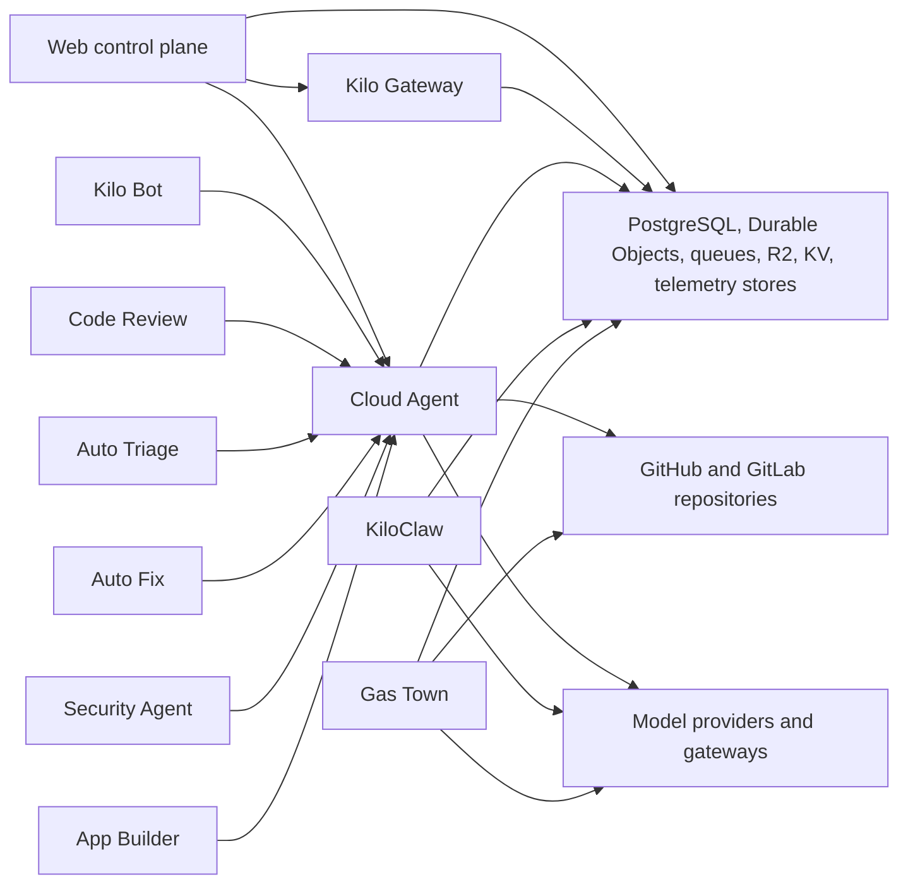

# Cloud Platform Architecture

Kilo Cloud is the hosted platform layer for authentication, provider routing, billing, product configuration, automation, and scoped execution services. It lives in the open-source `Kilo-Org/cloud` repository.


Cloud implementation details live in the open-source [`Kilo-Org/cloud`](https://github.com/Kilo-Org/cloud) repository and production configuration. Use [Kilo Cloud Security Architecture](/docs/contributing/architecture/cloud-security) for security-specific topology, trust boundaries, data flows, and persistence.


## Source Map

| Concern | Source |
|---|---|
| Cloud Agent Next session service | `services/cloud-agent-next/src/session-service.ts` |
| Cloud Agent sandbox identity | `services/cloud-agent-next/src/sandbox-id.ts` |
| Cloud Agent workspace paths | `services/cloud-agent-next/src/workspace.ts` |
| Legacy Cloud Agent API | `services/cloud-agent/README.md` |
| KiloClaw providers | `services/kiloclaw/src/providers/index.ts` |
| Gas Town Durable Objects | `services/gastown/src/dos/` |
| Automation services | `apps/web/src/lib/code-reviews/`, `apps/web/src/lib/auto-triage/`, `apps/web/src/lib/auto-fix/` |
| Security Agent | `apps/web/src/lib/security-agent/`, `services/security-auto-analysis/` |

## Service Map

## Kilo Gateway

The gateway (`packages/kilo-gateway/` in this repo, plus cloud API routes) handles account-aware model access.

| Responsibility | Description |
|---|---|
| Authentication | Device flow auth, token management, and account linking |
| Provider routing | Routes model requests through managed keys, user keys, custom endpoints, or configured gateways |
| Model catalog | Serves available models and provider configuration |
| Usage and billing | Tracks token consumption, credits, entitlements, and billing metadata |

## Cloud Agent

Cloud Agent is a Cloudflare Worker-backed service for hosted coding tasks. It runs Kilo CLI sessions in Cloudflare sandbox containers with GitHub and GitLab integration.

Current architecture uses session-specific workspaces and home directories inside policy-driven sandbox containers:

| Area | Model |
|---|---|
| Sandbox identity | Default shared owner-scoped sandboxes by organization/user, personal user, bot, or user/bot combination |
| Per-session policy | Selected organizations in `PER_SESSION_SANDBOX_ORG_IDS` use per-session sandboxes |
| Devcontainer policy | Devcontainer mode uses DIND per-session sandboxes |
| Session isolation | Each session gets its own working directory, HOME, and git workspace |
| Shared container state | Default policy allows multiple sessions to run in the same sandbox and share container filesystem state outside session paths |
| Streaming | Session output streams through WebSocket-based flows with replay support |
| Durable state | Durable Objects coordinate session metadata, command queueing, event replay, and lifecycle state |

## Current Implementation Notes

- `services/cloud-agent-next` is the current queue-first and session-message path used by modern automation.
- `services/cloud-agent` remains a legacy V2/SSE-compatible surface where still referenced.
- Avoid treating legacy behavior or per-session sandbox policy as universal Cloud Agent behavior.

## Automation Services

Detailed queue, callback, and worker behavior lives in [Automation Services](/docs/contributing/architecture/automation-services).

| Service | Primary surface | Launches Cloud Agent | Role |
|---|---|---|---|
| [Kilo Bot](/docs/contributing/architecture/automation-services#kilo-bot-and-app-builder) | `apps/web/src/lib/bot/`, `apps/web/src/lib/bots/` | Yes | Responds to GitHub and GitLab issue comments or PR mentions and dispatches coding work |
| [Code Review](/docs/contributing/architecture/automation-services#code-review) | `apps/web/src/lib/code-reviews/`, `services/code-review-infra/` | Yes | Queues pull-request review work, runs Cloud Agent review sessions, and posts feedback |
| [Auto Triage](/docs/contributing/architecture/automation-services#auto-triage) | `apps/web/src/lib/auto-triage/`, `services/auto-triage-infra/` | Yes | Classifies issues, detects duplicates, applies labels, and can trigger fix workflows |
| [Auto Fix](/docs/contributing/architecture/automation-services#auto-fix) | `apps/web/src/lib/auto-fix/`, `services/auto-fix-infra/` | Yes | Creates issue-fix PRs through Cloud Agent when triggered by labels or dispatch rules |
| [Security Agent](/docs/contributing/architecture/security-agent) | `apps/web/src/lib/security-agent/`, `services/security-auto-analysis/` | Conditional | Syncs security findings and launches Cloud Agent only when triage selects deep sandbox analysis |
| [App Builder](/docs/contributing/architecture/automation-services#kilo-bot-and-app-builder) | `apps/web/src/lib/app-builder/` | Yes | Uses Cloud Agent to scaffold, iterate on, and deploy generated applications from prompts |

## KiloClaw

KiloClaw is an owner-scoped hosted OpenClaw platform orchestrated by Cloudflare Workers. Each owner gets a dedicated persistent runtime running an OpenClaw gateway. Durable Objects coordinate lifecycle state, routing, configuration, and self-healing reconciliation.

KiloClaw supports provider-backed runtimes. Fly is an important provider path and legacy fallback; docker-local is used for local development; Northflank support exists in the provider model. Avoid documenting provider-specific behavior as universal unless source and production configuration confirm it.



## Gas Town

Gas Town is a multi-agent orchestration platform for autonomous AI coding work on real repositories. It runs on Cloudflare Workers, Durable Objects, and Cloudflare Containers.

| Concept | Description |
|---|---|
| Town | Workspace or project that contains one or more rigs |
| Rig | Git repository attached to a town |
| Bead | Unit of work such as issue, task, merge request, or message |
| Convoy | Batch of related beads with dependency tracking |
| Mayor | Persistent conversational coordinator that decomposes work and delegates |
| Polecat | Worker agent that clones repos, writes code, commits, pushes, and creates PRs |
| Refinery | Review agent that reviews branches, runs quality gates, merges, or requests rework |
| Triage | Ephemeral agent that resolves ambiguous situations detected by automated checks |

A Town Durable Object drives state transitions. When agents are active, the alarm cadence is 5 seconds; slower watchdog and idle paths exist for inactive or health-check scenarios.

## Supporting Services

| Service | Purpose |
|---|---|
| Webhook Agent Ingest | Named webhook endpoints that capture HTTP requests and queue delivery to Cloud Agent |
| AI Attribution | Tracks line-level AI-generated code attribution when users accept or reject edits |
| Session Ingest | Ingests and stores CLI session data for analytics and product workflows |
| Observability | Telemetry, logs, metrics, tracing, and alerting integrations for cloud services |
