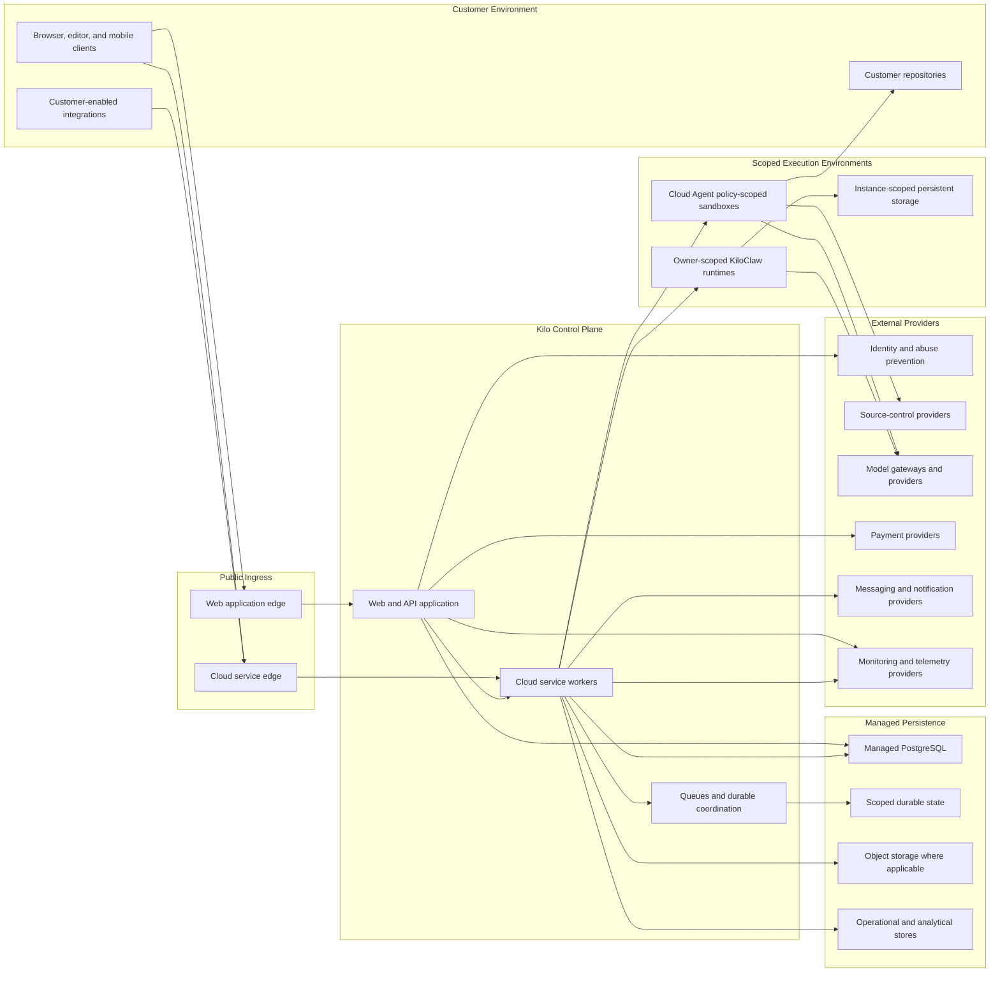
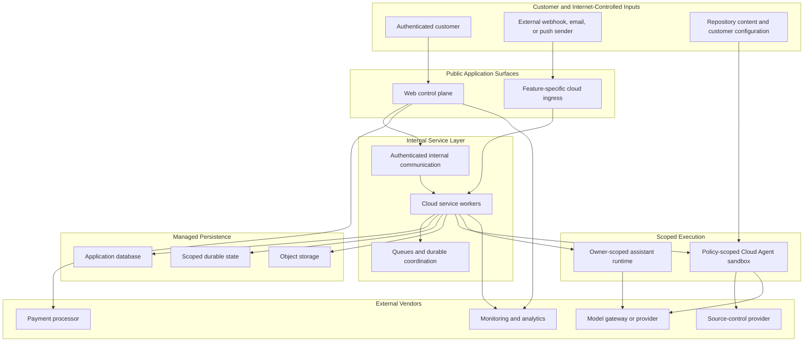
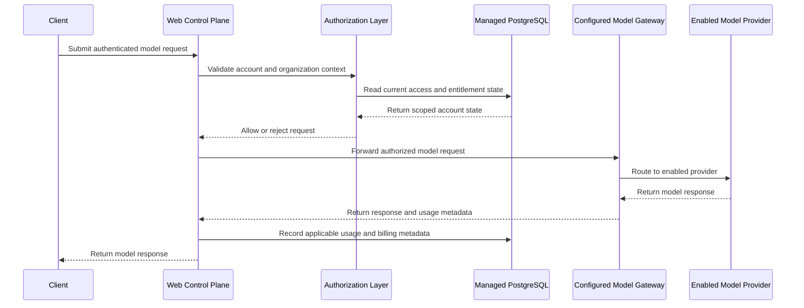
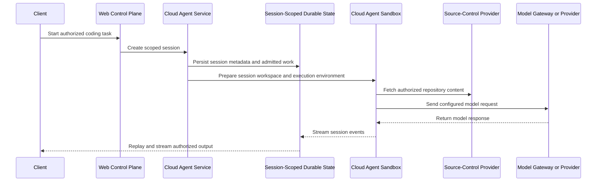
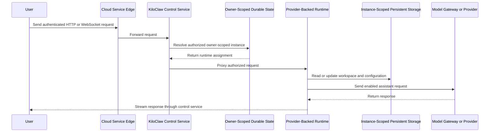
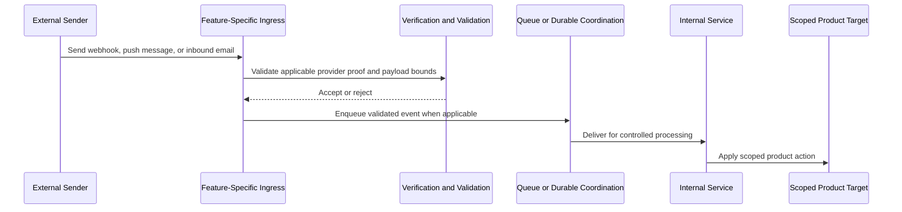

# Kilo Cloud Security Architecture

This page gives contributors and customer security reviewers a high-level view of Kilo Cloud's security architecture. It covers logical topology, trust boundaries, data flows, persistence, execution isolation, external integrations, and shared responsibility.


This overview is not a penetration test report, data processing agreement, subprocessor list, business continuity plan, or compliance attestation. Production-only controls such as exact regions, retention settings, backup policy, WAF rules, credential rotation, and vendor enablement must be validated against the live production inventory.


## Executive Overview

Kilo Cloud combines a web control plane with Cloudflare-hosted service components and scoped execution environments.

- Customer browsers, editor clients, mobile clients, and enabled integrations connect to public application surfaces.
- A Vercel-hosted Next.js application provides account management, organization authorization, billing, product configuration, and API orchestration.
- Cloudflare Workers provide feature-specific ingress, authenticated internal service communication, queue-backed workflows, durable coordination, real-time streams, and selected sandbox orchestration.
- Managed PostgreSQL stores relational control-plane records. Cloudflare Durable Objects, queues, KV, R2 object storage, and optional specialized stores support scoped state, event processing, caching, and feature-specific content storage.
- Cloud Agent coding sessions execute in Cloudflare sandbox containers with session-specific workspaces and policy-driven sandbox identity.
- KiloClaw assistant instances run in owner-scoped, provider-backed runtimes with instance-scoped persistent storage and encrypted configuration delivery.
- External providers may be invoked as platform dependencies, operational services, enabled product capabilities, or customer-selected integrations.

## Logical Network Topology

| Layer | Customer-facing description | Security relevance |
|---|---|---|
| Client applications | Browser, editor, mobile, and supported application clients | User-controlled environments where authentication begins |
| Web control plane | Next.js application hosted on Vercel | Identity, organization authorization, billing, configuration, and API orchestration |
| Cloud service layer | Cloudflare Workers connected through feature-specific ingress and service bindings | Authenticated APIs, asynchronous workflows, durable coordination, streaming, and integration delivery |
| Managed persistence | PostgreSQL, Durable Object storage, queues, object storage, caches, and feature-specific analytical stores | Scoped application records, durable state, reliable background processing, and operational telemetry |
| Cloud Agent execution | Policy-scoped sandbox containers with session-specific workspaces | Isolated coding-task execution with authorized repository and model access |
| KiloClaw execution | Owner-scoped provider-backed runtimes with persistent storage | Dedicated assistant runtime with scoped configuration and lifecycle coordination |
| External providers | Identity, source-control, model, billing, messaging, telemetry, and optional tool providers | Third-party trust boundaries invoked by enabled capabilities |

## Trust Boundaries

| Boundary | What crosses it | Primary controls |
|---|---|---|
| Customer clients to public application surfaces | User sessions, bearer tokens, API requests, WebSocket connections, and customer input | Session and token validation, organization-aware authorization, client blocking logic, security headers, short-lived stream tickets where applicable, and configured origin allowlists on selected WebSocket paths |
| External systems to feature-specific ingress | Webhooks, inbound email, push messages, and scheduled callbacks | Provider signatures or tokens where applicable, optional shared-secret protection for customer-configured trigger endpoints, payload validation, bounded request sizes on selected paths, header redaction, idempotency handling, and queue-backed processing |
| Web control plane to Cloudflare services | Session preparation, orchestration, integration delivery, and internal callbacks | Service credentials, scoped callback tokens, or Cloudflare service bindings depending on the flow |
| Cloudflare services to persistence | Relational records, durable coordination state, queue messages, objects, and telemetry | Scoped identifiers, schema validation, service-specific authorization, and storage separation by feature |
| Control plane to execution environments | Repository metadata, task input, protected credentials, and runtime configuration | Session or owner scoping, isolated runtime allocation, encrypted secret transport for supported flows, and just-in-time secret availability |
| Kilo Cloud to third-party providers | OAuth flows, repository operations, model requests, payments, notifications, and telemetry | Provider-specific credentials, customer opt-in where applicable, scoped tokens where supported, and feature-based routing |

## Identity and Access

The web control plane uses JWT-backed application sessions and supports multiple sign-in methods. Repository-supported identity providers include Google, Apple, GitHub, GitLab, Discord, LinkedIn OpenID Connect, WorkOS enterprise SSO, and email magic links.

Kilo Cloud distinguishes among several authorization contexts:

- Browser sessions for customer use of the web application.
- Signed bearer tokens for non-browser clients and selected cloud services.
- Organization membership and role checks for tenant-scoped operations.
- Administrative authorization for restricted operational capabilities.
- Internal service credentials, callback tokens, and Cloudflare service bindings for machine-to-machine communication.
- Short-lived streaming or connection tickets for selected real-time channels.
- Provider-specific signature validation or token validation for supported external ingress paths.

Application data is commonly scoped to either a user or an organization. Cloud Agent durable session state is session-scoped; Cloud Agent sandbox identity is policy-driven. KiloClaw runtimes are owner-scoped rather than shared global assistant processes.

## Data and Persistence

| Data category | Examples | Typical processing context |
|---|---|---|
| Identity and account data | Email address, name, profile metadata, authentication-provider links, and account state | Sign-in, account administration, support, and privacy workflows |
| Organization and access data | Organization membership, roles, invitations, SSO domains, and audit actors | Tenant authorization and enterprise administration |
| Billing metadata | Customer identifiers, subscription state, transaction references, invoices, and limited payment-method metadata | Billing, entitlement, reconciliation, and financial record keeping |
| Usage and operational metadata | Model selection, token counts, costs, feature status, session identifiers, timestamps, and error summaries | Usage metering, product operation, support, and reliability monitoring |
| Repository and automation data | Repository metadata, branch and commit references, issue or review context, webhook payloads, and security findings | Source-control integration, Cloud Agent work, review automation, and security features |
| AI and session content | Prompts, responses, conversation history, task metadata, attachments, and session events | AI inference, Cloud Agent sessions, KiloClaw, and explicitly enabled experiments |
| Integration configuration | OAuth connection metadata, provider configuration, webhook settings, and customer-provided secrets | Enabled integrations and owner-scoped runtime configuration |
| Network and anti-abuse telemetry | IP address, user agent, device or browser signals, and risk metadata | Abuse prevention, fraud controls, and security investigation |
| Mobile and notification data | Device tokens, notification status, and mobile-store transaction metadata | Mobile authentication, subscription handling, and notifications |

| Persistence surface | Primary role | Security review note |
|---|---|---|
| Managed PostgreSQL | Relational application system of record and workflow state | Production database vendor, regions, backup policy, and network controls require live environment validation |
| Cloudflare Durable Objects | Strongly consistent, scoped coordination and feature-specific state | Used for session, instance, notification, chat, ingestion, and orchestration workflows |
| Cloudflare Queues | Asynchronous processing, retry, and dead-letter workflows | Used where delivery should be decoupled from public ingress or long-running processing |
| Cloudflare R2 object storage | Session blobs, attachments, feature assets, staging objects, and telemetry export where applicable | Bucket policy, lifecycle, encryption, residency, and deletion behavior require production configuration validation |
| Cloudflare KV | Cache, rollout, deduplication, and operational configuration | Used for cache and configuration scenarios rather than strongly consistent authority |
| Optional cache and specialized stores | Redis-compatible cache, vector indexes, and analytical stores | Active provider and feature usage are environment-dependent |
| Runtime persistent storage | Owner-scoped KiloClaw workspace and configuration persistence | Bound to assigned provider-backed runtime and treated as a separate execution trust boundary |

Repository-supported controls include encrypted delivery for supported runtime secrets, fail-closed bootstrap behavior for encrypted KiloClaw configuration, logging guidance that prohibits tokens and credentials, header-redaction helpers, and user soft-delete workflows with documented retention exceptions.

## Core Data Flows

### Web Application and Model Request

The exact model subprocessor can vary by selected model, configured gateway, customer BYOK choice, organization-specific endpoint configuration, and controlled experiment routing.

### Cloud Agent Session

Cloud Agent sessions are coordinated durably and execute inside Cloudflare sandbox containers. Each session gets its own workspace and home directory. Sandbox identity is policy-driven: default shared owner-scoped sandboxes, selected per-session organization sandboxes, and DIND per-session devcontainer sandboxes. Session events can be replayed to authorized clients after reconnect.

Current implementation note: `services/cloud-agent-next` is the current queue-first and session-message path used by modern automation. `services/cloud-agent` remains a legacy V2/SSE-compatible surface where still referenced. Security claims should not treat legacy behavior or per-session sandbox policy as universal Cloud Agent behavior.

### KiloClaw Runtime

KiloClaw separates lifecycle coordination from the runtime process. The control service authenticates and scopes requests, durable state coordinates instance lifecycle, and assigned runtime uses persistent storage for workspace and configuration.

### External Event Ingestion

Externally reachable ingestion exists for feature-specific purposes such as source-control webhooks, payment events, mobile-store notifications, customer-configured webhook triggers, Gmail push notifications, and inbound email.

## Security Controls Summary

| Control area | Architecture-level control |
|---|---|
| Authentication | JWT-backed web sessions, bearer-token support for non-browser clients, enterprise SSO support, and provider-specific ingress verification |
| Authorization | User, organization, role, and administrative checks applied according to operation |
| Abuse prevention | Turnstile login checks, fraud telemetry, client blocking logic, bounded payload handling on selected external ingress, and deployment threat scanning |
| Internal service separation | Cloudflare service bindings, scoped callback tokens, and service credentials separate public access from internal orchestration |
| Execution isolation | Cloud Agent session workspaces inside policy-scoped sandbox containers and owner-scoped KiloClaw runtimes separate untrusted task execution from web control plane |
| Secret handling | Protected configuration storage, encrypted delivery for supported runtime secrets, fail-closed bootstrap behavior, and logging prohibitions for sensitive values |
| Data minimization and privacy | Soft-delete and anonymization workflows, redacted webhook headers, explicit experiment opt-in paths, and retention exceptions documented by purpose |
| Reliability and integrity | Durable coordination, queue-backed workflows, retries, dead-letter patterns, idempotency handling, and instance reconciliation where applicable |
| Browser hardening | HSTS, framing restrictions, MIME sniffing protection, referrer policy, cross-origin policies, permissions restrictions, and configurable Content Security Policy reporting or enforcement |
| Observability | Error reporting, structured operational metrics, log aggregation, and alerting integrations with production retention and access settings managed operationally |

## Third-party Integration Categories

| Status | Meaning |
|---|---|
| Platform dependency | Represented as part of platform architecture or deployment path |
| Feature-dependent | Invoked when relevant capability is used or enabled; live production enablement requires validation |
| Customer-configured | Opt-in integration or endpoint selected and configured by customer |
| Runtime-selected | Supported by repository, but active provider, route, or rollout is determined outside static source code |
| Production validation required | Referenced by code or configuration, but live enablement or provider details must be confirmed before external contractual claim |

| Category | Examples | Security-relevant role |
|---|---|---|
| Hosting, edge, storage, and runtime | Vercel, Cloudflare, managed PostgreSQL, runtime hosting, Redis-compatible caches, vector indexes, Snowflake | Web control plane hosting, edge services, persistence, runtime execution, caching, indexing, analytics, and billing-query workflows |
| Identity, security, and source control | Google, Apple, GitHub, GitLab, Discord, LinkedIn, WorkOS, Turnstile, Stytch, Google Web Risk | Sign-in, enterprise SSO, abuse prevention, repository integration, webhook handling, automation, and deployment URL threat scanning |
| AI, search, and customer-selected models | OpenRouter, Vercel AI Gateway, direct model providers, BYOK providers, custom model endpoints, Exa, Mistral | Model routing, AI inference, search, embeddings, and customer-selected outbound trust boundaries |
| Billing, messaging, support, and mobile | Stripe, Apple App Store, Churnkey, Impact.com, Mailgun, NeverBounce, Customer.io, Pylon, Expo, Gmail APIs, Slack, Discord, Telegram, Linear, AppsFlyer | Payments, signed billing events, transactional messages, lifecycle tooling, support, mobile notifications, customer-configured messaging, and attribution |
| Monitoring and operations | Sentry, PostHog, Axiom, Cloudflare Analytics Engine, Cloudflare Pipelines, Better Stack | Error reporting, product analytics, log analysis, metrics export, and heartbeat monitoring |

## Privacy, Logging, and Retention

Kilo Cloud includes user soft-delete workflows that anonymize direct user PII, rotate or invalidate authentication material, delete many user-owned records and integrations, remove selected object-storage content, and request deletion from selected downstream services. Financial, audit, anti-abuse, and product-specific records can have documented retention exceptions.

Operational telemetry can still contain customer-linked identifiers and diagnostic content, so production access control, filtering, retention, and vendor configuration remain important controls. Mobile diagnostic telemetry, replay masking, screenshots, view hierarchy capture, object-storage deletion, Durable Object state, vector stores, analytical stores, runtime volumes, backups, and enabled third-party processors require production privacy review before making external commitments.

Data paths vary by product and enabled integration. Residency and retention commitments should be stated only in applicable contractual or product documentation after validation against live production inventory.

## Shared Responsibility

Kilo Cloud provides platform controls for authentication, scoped authorization, internal-service separation, durable coordination, execution isolation, and protected handling of supported secrets.

Customers remain responsible for decisions that expand enabled trust boundaries, including:

- Which repositories, organizations, users, and source-control installations they authorize.
- Which models, BYOK credentials, custom model endpoints, and optional integrations they enable.
- Which setup commands, repository code, MCP servers, and third-party tools they permit inside an isolated agent session or owner-scoped runtime.
- Whether customer-configured endpoints and credentials meet their own security, privacy, and compliance requirements.
- How they review generated changes before merging or deploying them.
