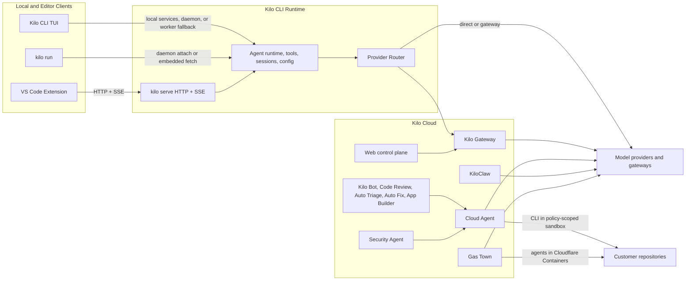

# Architecture Overview

This page is the contributor-facing map for Kilo's major systems. It shows how the CLI, editor clients, cloud services, and hosted runtimes fit together, then links to focused architecture pages for deeper implementation details.


This overview is intentionally high level. Use the linked pages for runtime details, VS Code backend behavior, Kilo Cloud services, security boundaries, and implementation patterns.


## Platform Map

Kilo is built around the CLI agent runtime. Some surfaces use local runtime services directly, some attach to a daemon or `kilo serve` process over HTTP + SSE, and hosted cloud services run the CLI inside policy-scoped execution environments or route model traffic through Kilo Cloud.

## Product and Runtime Matrix

| Surface | Primary package or repo | Runtime model |
|---|---|---|
| Kilo CLI TUI | `packages/opencode/` | Renders a SolidJS OpenTUI interface and can use daemon attach or local fallback paths |
| `kilo run` | `packages/opencode/` | Runs headless single-prompt execution through explicit attach, daemon attach, or embedded server fetch |
| `kilo serve` | `packages/opencode/` | Exposes the CLI runtime through HTTP + SSE for clients |
| VS Code Extension | `packages/kilo-vscode/` | Creates one shared connection service and lazily starts one shared `kilo serve --port 0` backend; autocomplete can prewarm it |
| Kilo Cloud | `Kilo-Org/cloud` | Hosts authentication, billing, model routing, integrations, automation, and scoped execution services |
| Cloud Agent | `Kilo-Org/cloud` | Runs coding sessions in Cloudflare sandbox containers with session-specific workspaces and policy-driven sandbox identity |
| Security Agent | `Kilo-Org/cloud` | Syncs Dependabot findings and runs queue-backed LLM or Cloud Agent analysis for security issues |
| KiloClaw | `Kilo-Org/cloud` | Runs owner-scoped OpenClaw runtimes coordinated by Cloudflare Durable Objects |
| Gas Town | `Kilo-Org/cloud` | Runs multi-agent towns through Cloudflare Workers, Durable Objects, and Cloudflare Containers |

## Architecture Pages

| Page | What it covers |
|---|---|
| [CLI Runtime](/docs/contributing/architecture/cli-runtime) | CLI modes, in-process vs HTTP clients, server API, provider routing, and core subsystems |
| [VS Code Extension](/docs/contributing/architecture/vscode-extension) | Extension backend lifecycle, shared connection service, Agent Manager, worktree routing, and webview architecture |
| [Cloud Platform](/docs/contributing/architecture/cloud-platform) | Kilo Cloud service inventory, Cloud Agent, KiloClaw, Gas Town, automation services, and supporting services |
| [Security Agent Architecture](/docs/contributing/architecture/security-agent) | Dependabot sync, security finding model, auto-analysis queue, Cloud Agent launch path, and operational controls |
| [Automation Services](/docs/contributing/architecture/automation-services) | Kilo Bot, Code Review, Auto Triage, Auto Fix, App Builder, webhook triggers, worker boundaries, and Cloud Agent callbacks |
| [Kilo Cloud Security Architecture](/docs/contributing/architecture/cloud-security) | Cloud topology, trust boundaries, data flows, persistence, execution isolation, controls, and third-party categories |
| [Development Patterns](/docs/contributing/architecture/development-patterns) | Module exports, server API conventions, tool implementation pattern, SDK regeneration, and build system notes |
| [Features](/docs/contributing/architecture/features) | Feature-specific architecture specs and design notes |

## Repository Boundaries

| Repository | Contents |
|---|---|
| [Kilo-Org/kilocode](https://github.com/Kilo-Org/kilocode) | CLI engine, VS Code extension, SDK, gateway client, telemetry, docs, UI components |
| [Kilo-Org/cloud](https://github.com/Kilo-Org/cloud) | Web dashboard, Cloud Agent, Kilo Bot, KiloClaw, Gas Town, code review, auto triage, billing, and supporting Cloudflare Workers |

## Further Reading

- [Development Environment](/docs/contributing/development-environment) - Setup guide
- [Ecosystem](/docs/contributing/ecosystem) - Related projects and integrations
- [KiloClaw Overview](/docs/kiloclaw/overview) - Customer-facing hosted OpenClaw docs
