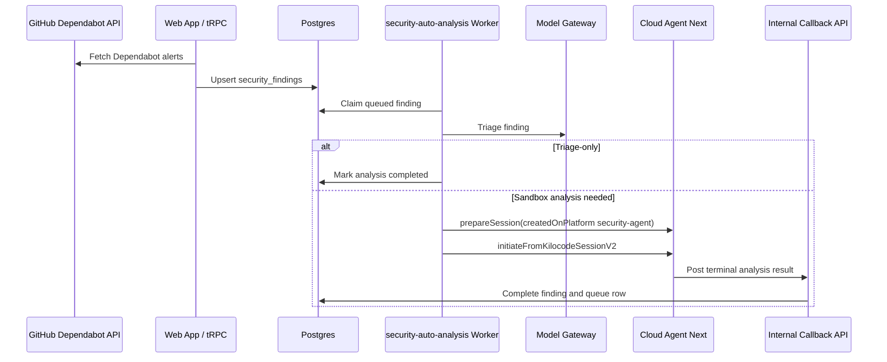

# Security Agent Architecture

Security Agent manages dependency vulnerability findings for personal and organization owners, then runs agentic analysis when configured.


This page covers current Security Agent architecture in the open-source `Kilo-Org/cloud` repo. Dependabot is current. `pnpm audit` fallback and GitHub Issues as a finding source are future, not current behavior.


## Source Map

| Concern | Source |
|---|---|
| Product library | `apps/web/src/lib/security-agent/` |
| Product routes | `apps/web/src/app/(app)/security-agent/`, `apps/web/src/app/(app)/organizations/[id]/security-agent/` |
| UI components | `apps/web/src/components/security-agent/` |
| Dependabot integration | `apps/web/src/lib/security-agent/github/dependabot-api.ts` |
| Finding parser | `apps/web/src/lib/security-agent/parsers/dependabot-parser.ts` |
| Sync service | `apps/web/src/lib/security-agent/services/sync-service.ts` |
| Auto-analysis worker | `services/security-auto-analysis/` |
| Cloud Agent launch | `services/security-auto-analysis/src/launch.ts` |
| Queue consumer | `services/security-auto-analysis/src/consumer.ts` |

## System Flow

## Product Surfaces

| Surface | Role |
|---|---|
| Dashboard | Owner-level security status, counts, and latest activity |
| Findings list | Filterable dependency vulnerability inventory |
| Finding detail | Vulnerability metadata, package impact, status, and analysis result |
| Config page | SLA, enablement, and auto-analysis settings |
| Audit log | Security Agent activity history |
| Personal routes | User-owned findings and configuration |
| Organization routes | Organization-owned findings and configuration |

## Data Sources

| Source | Status | Notes |
|---|---|---|
| GitHub Dependabot API | Current | Primary source for open, fixed, dismissed, and auto-dismissed dependency alerts |
| `pnpm audit` | Future | Mentioned as fallback source but not current production path |
| GitHub Issues | Future | Mentioned as possible future source, not current finding source |

Security Agent requires GitHub App access to `vulnerability_alerts: read`. When permission is missing, the web app can show reauthorization flow for the installation.

## Data Model

| Table | Role |
|---|---|
| `security_findings` | Normalized vulnerability finding records keyed by repository, source, and source ID |
| `security_analysis_queue` | Queue row for finding analysis lifecycle |
| `security_analysis_owner_state` | Owner-level pause, block, and failure state |
| `agent_configs` | Security Agent enablement, SLA, and auto-analysis configuration |
| `security_audit_log` | Security Agent activity record |

`security_findings` owner scope is exclusive: each row belongs to either one organization or one user. Dependabot states map into Kilo statuses such as open, fixed, and ignored.

## Sync Flow

1. Web app checks GitHub App permissions for the owner integration.
2. Sync service fetches Dependabot alerts from GitHub with installation-token authentication.
3. Parser normalizes Dependabot payloads into Security Agent finding fields.
4. Database layer upserts rows into `security_findings` by repository, source, and source ID.
5. SLA helper calculates due dates by severity using Security Agent configuration.

## Auto-Analysis Flow

| Step | Behavior |
|---|---|
| Dispatch | Per-minute cron and manual dispatch discover owners with queued analysis work |
| Claim | Worker claims eligible rows per owner with pessimistic locking and `FOR UPDATE SKIP LOCKED` |
| Actor | Worker resolves actor user and GitHub token through owner-scoped rules |
| Triage | LLM triage decides whether sandbox analysis is needed |
| Triage-only | Low-risk or no-sandbox-needed findings complete without Cloud Agent |
| Deep analysis | Deep mode, or auto mode with triage requesting sandbox work, launches `cloud-agent-next` |
| Callback | Cloud Agent posts terminal result to internal callback route for finding completion |

Cloud Agent launch sets `createdOnPlatform: "security-agent"` and passes a callback target with a derived callback token. Sandbox analysis inherits Cloud Agent's policy-driven sandbox identity: default shared owner-scoped sandboxes, selected per-session organization sandboxes, and DIND per-session devcontainer sandboxes.

## Operational Controls

| Control | Current behavior |
|---|---|
| Queue states | `queued`, `pending`, `running`, `completed`, `failed` |
| Retry classes | Retryable launch/callback failures, non-retryable config or permission failures, and credit-gated failures |
| Owner pause | `security_analysis_owner_state` can block an owner with `OPERATOR_PAUSE` |
| Credit gating | Insufficient credits block owner processing with cooldown |
| Actor blocks | Missing eligible actor or GitHub token can block an owner |
| Global stop | Disable cron and pause queue consumer |
| Stale rows | Pending and running stale thresholds exist; automated stale-row reconciliation is not current |

## Security Boundaries

| Boundary | Controls |
|---|---|
| GitHub access | Installation tokens and `vulnerability_alerts: read` permission |
| Owner scope | Findings, queue rows, and owner state are scoped to user or organization owner |
| Internal worker calls | Bearer auth, internal API secret, and service bindings where applicable |
| Callback | Derived callback token scoped to security-analysis callback and finding ID |
| Sandbox execution | Cloud Agent session workspace isolation inside policy-scoped sandbox containers |
| Auditability | Security Agent changes and analysis activity write to audit surfaces |

## Related Systems

| System | Relationship |
|---|---|
| [Cloud Platform](/docs/contributing/architecture/cloud-platform) | Cloud service inventory and Cloud Agent runtime context |
| [Automation Services](/docs/contributing/architecture/automation-services) | Similar queue, worker, callback, and Cloud Agent launch patterns |
| [Kilo Cloud Security Architecture](/docs/contributing/architecture/cloud-security) | Trust boundaries, persistence, provider categories, and execution isolation |
| Kilo Gateway | Model routing for LLM triage and analysis |
| Git token service | Resolves GitHub tokens for repository access during sandbox analysis |
