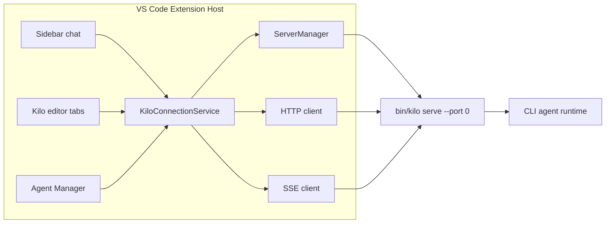

# VS Code Extension Architecture

The VS Code extension (`packages/kilo-vscode/`) is a client of the CLI. It bundles the CLI binary, starts a shared backend process on demand, and drives that backend through HTTP + SSE using `@kilocode/sdk`.


This page covers extension backend lifecycle, shared connection behavior, Agent Manager routing, and build boundaries. It is not a full extension feature inventory.


## Source Map

| Concern | Source |
|---|---|
| Activation and shared service creation | `packages/kilo-vscode/src/extension.ts` |
| Backend process lifecycle | `packages/kilo-vscode/src/services/cli-backend/server-manager.ts` |
| Shared SDK and SSE connection | `packages/kilo-vscode/src/services/cli-backend/connection-service.ts` |
| Agent Manager provider | `packages/kilo-vscode/src/agent-manager/AgentManagerProvider.ts` |
| SDK SSE adapter | `packages/kilo-vscode/src/services/cli-backend/sdk-sse-adapter.ts` |

## Extension to CLI Backend

Activation creates one shared `KiloConnectionService`. The CLI backend starts lazily on client demand; autocomplete may prewarm it during activation. When a connection starts, `ServerManager` starts the bundled `bin/kilo serve --port 0`, captures the assigned port from stdout, and communicates with that process over HTTP + SSE. The current backend process is reused unless it exits.

## Shared Backend Model

| Area | Behavior |
|---|---|
| Process ownership | `KiloConnectionService` owns the active backend process, HTTP client, and SSE connection |
| Process startup | `ServerManager` lazily starts the bundled CLI binary on client demand or autocomplete prewarm, and replaces it if it exits |
| Authentication | A random password is passed through `KILO_SERVER_PASSWORD` for backend basic auth |
| Event routing | Multiple webviews subscribe to the shared SSE stream and filter by tracked session IDs |
| Backend reuse | Sidebar, Kilo editor tabs, and Agent Manager all use the same active backend process |

## Agent Manager

Agent Manager is an extension feature, not a separate product. It opens as an editor tab and supports multiple AI sessions in parallel, each optionally isolated in its own git worktree.

| Aspect | Sidebar | Agent Manager |
|---|---|---|
| Primary use | Single active chat flow | Multi-session orchestration |
| Git isolation | Workspace root by default | Optional worktree per session |
| Backend process | Shared `kilo serve` process | Same shared `kilo serve` process |
| Session routing | Current workspace directory | Session-specific `directory` passed to backend requests |
| Auxiliary processes | Extension host and backend | Worktree setup scripts, terminals, git subprocesses, and optional extra VS Code windows |

Agent Manager worktree sessions do not start independent `kilo serve` processes. Their requests pass the worktree path as `directory`, which lets directory-scoped backend state resolve to the correct project context.

## State Boundaries

Backend state follows where it is allocated. Directory-keyed state is isolated by worktree path. Process-level state in the active CLI backend can still be shared across requests that use the same backend process. Contributors should be careful when adding mutable service state that assumes one workspace or one webview.

## Builds

| Build | Source | Output |
|---|---|---|
| Extension host | `src/extension.ts` | Node/CommonJS extension bundle |
| Sidebar webview | `webview-ui/src/index.tsx` | Browser webview bundle |
| Agent Manager webview | `webview-ui/agent-manager/index.tsx` | Browser webview bundle |

Use the extension package checks when changing this area: `bun run typecheck`, `bun run lint`, and targeted unit tests from `packages/kilo-vscode/`.
